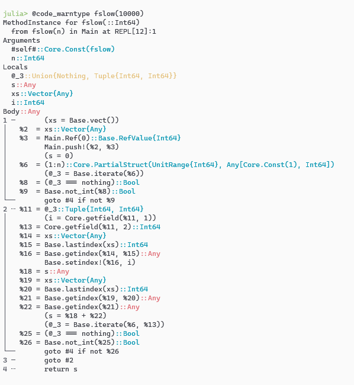
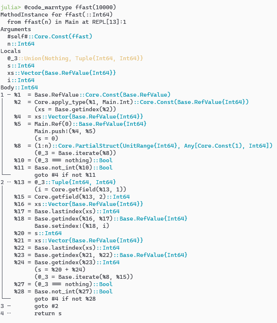
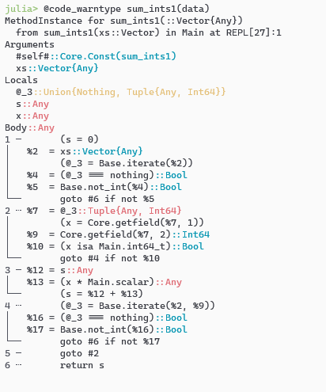

## 类型不稳定 1：字段

```julia
mutable struct X
    a :: Any
end

xs = [X(1) for i = 1:10000]

function sum1(xs::AbstractVector{X})
    s = 0
    for x in xs
        s += x.a
    end
    return s
end

function sum2(xs::AbstractVector{X})
    s = 0
    for x in xs
        s += x.a :: Int
    end
    return s
end

@btime sum1(xs)
#   147.800 μs (9489 allocations: 148.27 KiB)
10000

@btime sum2(xs)
#   5.567 μs (1 allocation: 16 bytes)
10000

```

如果想要检测性能问题，可以使用`@code_warntype`检测类型稳定性，还可以用`@code_llvm`检测是否调用`jl_apply_generic`函数。

`@code_llvm sum1(xs)`或者 `code_llvm(sum1, (typeof(xs1), ))`，可以发现存在 `jl_apply_generic`，这意味着动态分派。

Julia动态分派的性能差。

```julia
struct SomeType{T}
    f1::T
    f2::T
    f3::T
end

data = SomeType(1, 2, 3)

function f(x::Any)
    data.f1 + data.f2 + data.f3
end
```

## 类型不稳定 2： 数组类型

```julia
using BenchmarkTools

function fslow(n)
    xs = [] # equals to 'Any[]'
    push!(xs, Ref(0))
    s = 0
    for i in 1:n
        xs[end][] = i
        s += xs[end][]
    end
    return s
end

function ffast(n)
    xs = Base.RefValue{Int}[]
    push!(xs, Ref(0))
    s = 0
    for i in 1:n
        xs[end][] = i
        s += xs[end][]
    end
    return s
end

@btime fslow(10000)
#   432.200 μs (28950 allocations: 452.44 KiB)
50005000

@btime ffast(10000)
#   4.371 μs (3 allocations: 144 bytes)
50005000
```

`InteractiveUtils.@code_warntype`可以发现类型不稳定的问题。黄色的代码表示可能存在问题，红色表示存在问题。





## 类型不稳定 3：类型不稳定的全局变量

```julia
int64_t = Int
scalar = 3

function sum_ints1(xs::Vector)
    s = 0
    for x in xs
        if x isa int64_t
            s += x * scalar
        end
    end
    return s
end

# const Int = Int
const const_scalar = 3
function sum_ints2(xs::Vector)
    s = 0
    for x in xs
        if x isa Int
            s += x * const_scalar
        end
    end
    return s
end

data = [i % 2 == 0 ? 1 : "2" for i = 1:1000000]

@btime sum_ints1(data)
#  18.509 ms (499830 allocations: 7.63 MiB)
1500000

@btime sum_ints2(data)
#  476.600 μs (1 allocation: 16 bytes)
1500000
```

可以用`@code_warntype`看到性能问题：




## 顶层作用域性能问题

```julia
xs = ones(Int, 1000000)
t0 = time_ns()
s = 0
for each in xs
    s += each
end
s
println("time elapsed: ", time_ns() - t0, "ns")
# time elapsed: 115459800ns

@noinline test_loop(xs) = begin
    t0 = time_ns()
    s = 0
    for each in xs
        s += each
    end
    println("time elapsed: ", time_ns() - t0, "ns")
    return s
end
test_loop(xs) === 1000000
# time elapsed: 433500ns
```